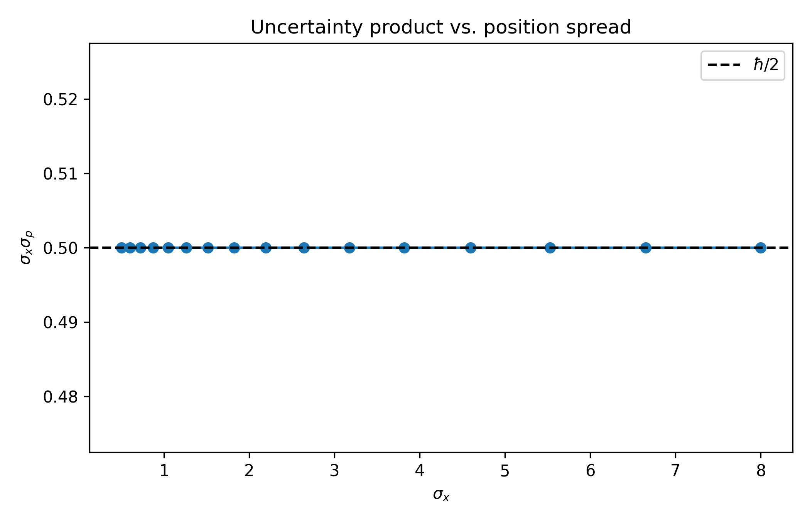
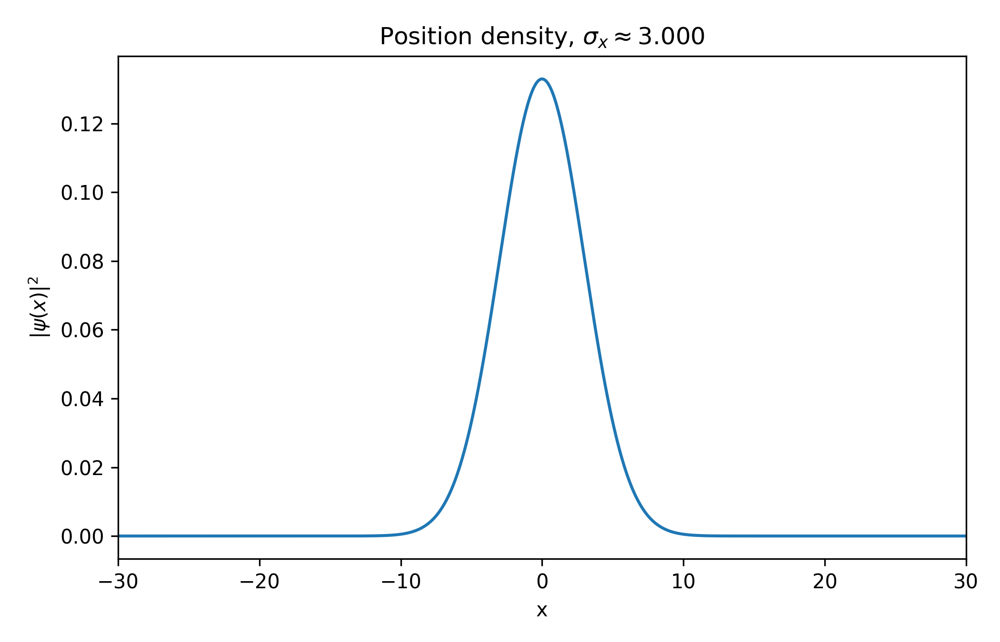
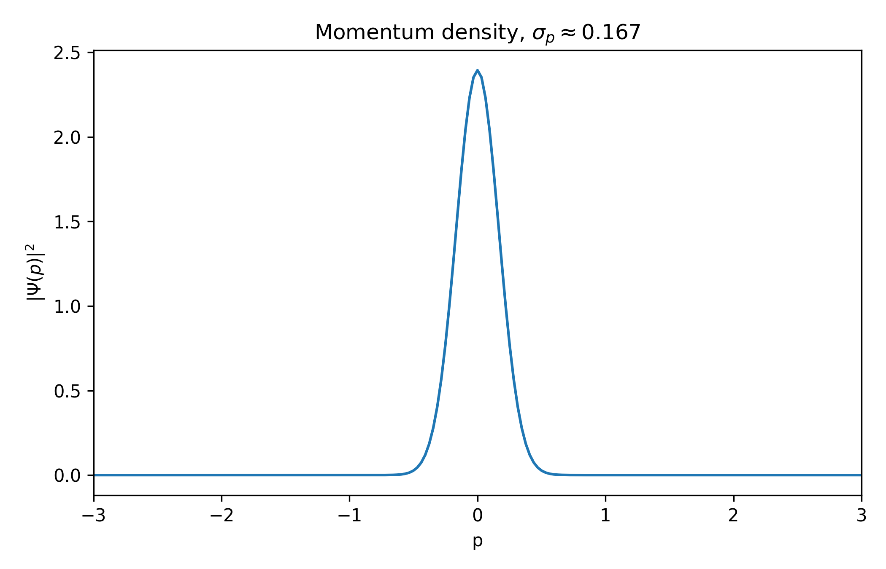
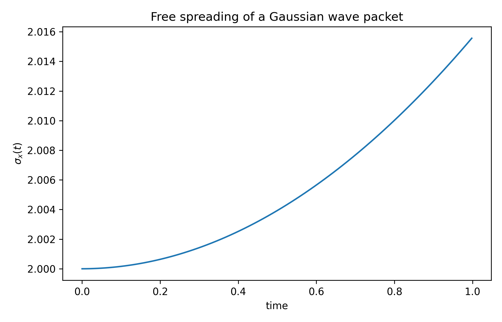

# Numerical Demonstration of the Heisenberg Uncertainty Principle using Gaussian Wave Packets

**Stefan Len**

*Independent Researcher*

**Date:** October 15, 2025

---

## Abstract

I present a minimal numerical demonstration of the Heisenberg Uncertainty Principle using Gaussian wave packets in one spatial dimension. By systematically varying the initial position spread, I numerically verify the reciprocal relationship between position and momentum uncertainties and confirm that their product at the initial time achieves the theoretical minimum of ℏ/2. In addition, I simulate the free time evolution of the wave packet, illustrating the spreading of the position uncertainty while the momentum distribution remains constant. The results highlight the role of Gaussian wave packets as minimum-uncertainty states at the initial moment and provide an accessible, reproducible teaching tool for quantum mechanics.

**Keywords:** Heisenberg uncertainty principle, Gaussian wave packet, quantum mechanics, minimum uncertainty state, numerical simulation, pedagogical tool

---

## 1. Introduction

### 1.1 The Heisenberg Uncertainty Principle

The Heisenberg Uncertainty Principle, formulated by Werner Heisenberg in 1927 [1], represents one of the most fundamental departures of quantum mechanics from classical physics. It establishes that certain pairs of physical quantities—canonical conjugates such as position and momentum—cannot be simultaneously measured with arbitrary precision. Mathematically, for position x and momentum p:

$$\Delta x \cdot \Delta p \geq \frac{\hbar}{2}$$

where Δx and Δp are the standard deviations (uncertainties) of position and momentum, respectively, and ℏ is the reduced Planck constant. This inequality is not a statement about experimental limitations or measurement disturbance, but rather reflects a fundamental property inherent in the mathematical structure of quantum mechanics itself.

### 1.2 Gaussian Wave Packets as Minimum-Uncertainty States

Among all possible quantum states, Gaussian wave packets occupy a privileged position: they saturate the uncertainty bound at the initial time, achieving equality in the Heisenberg relation [2]. For a Gaussian state at t=0:

$$\Delta x \cdot \Delta p = \frac{\hbar}{2}$$

This property designates Gaussian wave packets as minimum-uncertainty states at the initial moment, representing the closest quantum analog to classical particles in their simultaneous localization in both position and momentum space. While related to harmonic oscillator coherent states in their minimum-uncertainty property, free-space Gaussian packets do not maintain this property under time evolution and should not be conflated with coherent states in the strict sense [7]. Their dual nature—exhibiting optimal localization in both position and momentum space at t=0—makes them ideal subjects for both theoretical analysis and pedagogical demonstration.

### 1.3 Computational Approach and Objectives

Numerical simulations provide direct, visual validation of abstract quantum mechanical principles that often resist intuitive understanding. This work employs a straightforward computational framework based on Fast Fourier Transform (FFT) techniques to:

1. Construct Gaussian wave packets with systematically varied position spreads
2. Compute momentum distributions via discrete Fourier transformation
3. Quantify position and momentum uncertainties numerically
4. Verify the Heisenberg uncertainty relation at the initial time across parameter space
5. Simulate free time evolution to demonstrate wave packet spreading

The primary objectives are to provide quantitative numerical verification of the uncertainty principle at the initial time, to illustrate the reciprocal relationship between conjugate uncertainties, and to offer a reproducible computational tool suitable for educational purposes in quantum mechanics courses.

---

## 2. Theory and Method

### 2.1 Quantum Mechanical Framework

#### 2.1.1 Wave Function and Probability Interpretation

In one-dimensional quantum mechanics, the state of a particle is described by a complex-valued wave function ψ(x,t) satisfying the Schrödinger equation. The probability density for finding the particle at position x is:

$$\rho(x) = |\psi(x)|^2$$

normalized such that:

$$\int_{-\infty}^{\infty} |\psi(x)|^2 dx = 1$$

#### 2.1.2 Position-Momentum Duality

The momentum-space representation is obtained through the Fourier transform:

$$\Psi(p) = \frac{1}{\sqrt{2\pi\hbar}}\int_{-\infty}^{\infty} \psi(x)e^{-ipx/\hbar}dx$$

with corresponding probability density in momentum space:

$$\rho_p(p) = |\Psi(p)|^2$$

This dual representation—position and momentum as complementary descriptions—lies at the heart of the uncertainty principle.

### 2.2 Gaussian Wave Packet Construction

#### 2.2.1 Initial State

A Gaussian wave packet centered at position x₀ with mean momentum p₀ has the analytical form:

$$\psi(x,0) = \left(\frac{1}{2\pi\sigma_x^2}\right)^{1/4} \exp\left[-\frac{(x-x_0)^2}{4\sigma_x^2} + \frac{ip_0(x-x_0)}{\hbar}\right]$$

where σₓ is the initial position spread. For my simulations, I set x₀ = 0 and p₀ = 0 (particle at rest at the origin):

$$\psi(x,0) = \left(\frac{1}{2\pi\sigma_x^2}\right)^{1/4} \exp\left[-\frac{x^2}{4\sigma_x^2}\right]$$

#### 2.2.2 Momentum Distribution

The Fourier transform of the initial Gaussian yields the momentum distribution:

$$\Psi(p,0) = \left(\frac{2\sigma_x^2}{\pi\hbar^2}\right)^{1/4} \exp\left[-\frac{\sigma_x^2 p^2}{\hbar^2}\right]$$

This is also Gaussian, with spread:

$$\sigma_p = \frac{\hbar}{2\sigma_x}$$

demonstrating the reciprocal relationship: as σₓ increases, σₚ decreases proportionally.

### 2.3 Uncertainty Quantification

#### 2.3.1 Position Uncertainty

The position uncertainty is defined as the standard deviation:

$$\Delta x = \sqrt{\langle x^2 \rangle - \langle x \rangle^2}$$

where expectation values are computed as:

$$\langle x \rangle = \int_{-\infty}^{\infty} x|\psi(x)|^2 dx$$

$$\langle x^2 \rangle = \int_{-\infty}^{\infty} x^2|\psi(x)|^2 dx$$

For a Gaussian wave packet, Δx = σₓ exactly.

#### 2.3.2 Momentum Uncertainty

Similarly, the momentum uncertainty is:

$$\Delta p = \sqrt{\langle p^2 \rangle - \langle p \rangle^2}$$

with:

$$\langle p \rangle = \int_{-\infty}^{\infty} p|\Psi(p)|^2 dp$$

$$\langle p^2 \rangle = \int_{-\infty}^{\infty} p^2|\Psi(p)|^2 dp$$

For the Gaussian momentum distribution, Δp = ℏ/(2σₓ).

#### 2.3.3 Uncertainty Product at Initial Time

Combining these results for t=0:

$$\Delta x \cdot \Delta p = \sigma_x \cdot \frac{\hbar}{2\sigma_x} = \frac{\hbar}{2}$$

This confirms analytically that Gaussian wave packets achieve the minimum uncertainty bound at the initial time.

#### 2.3.4 The Generalized Uncertainty Relation

The standard Heisenberg relation Δx·Δp ≥ ℏ/2 is actually a special case of the more general Schrödinger–Robertson uncertainty relation [3]:

$$\Delta x \cdot \Delta p \geq \sqrt{\left(\frac{\hbar}{2}\right)^2 + |\text{Cov}(x,p)|^2}$$

where the covariance is defined as:

$$\text{Cov}(x,p) = \frac{1}{2}\langle \hat{x}\hat{p} + \hat{p}\hat{x} \rangle - \langle \hat{x} \rangle \langle \hat{p} \rangle$$

For a Gaussian wave packet at t=0 with zero mean momentum (p₀=0), Cov(x,p)=0 and the product saturates the minimal bound: Δx·Δp = ℏ/2.

**Time evolution:** During free propagation, the momentum-position correlation develops (Cov(x,p) ≠ 0 for t>0), causing the uncertainty product to exceed ℏ/2 even though the wavefunction remains Gaussian. The numerical simulation presented here focuses on the initial (t=0) minimum-uncertainty configuration.

### 2.4 Time Evolution

#### 2.4.1 Free Particle Dynamics

For a free particle (no external potential), the time-evolved wave function can be obtained exactly. **For an initially minimum-uncertainty Gaussian wave packet with σₓ(0) and zero initial momentum (p₀=0)**, the position uncertainty evolves as:

$$\sigma_x(t) = \sigma_x(0)\sqrt{1 + \left(\frac{\hbar t}{2m\sigma_x^2(0)}\right)^2}$$

where m is the particle mass. This formula applies specifically to our initial conditions; more general initial states would exhibit different spreading behavior depending on their initial phase-space structure. This demonstrates that position uncertainty grows monotonically with time—a phenomenon known as wave packet spreading.

#### 2.4.2 Momentum Conservation

Crucially, the momentum-space **probability density** remains unchanged during free evolution:

$$|\Psi(p,t)|^2 = |\Psi(p,0)|^2$$

However, the momentum-space wavefunction itself acquires a time-dependent phase:

$$\Psi(p,t) = \Psi(p,0) \cdot \exp\left(-i\frac{p^2 t}{2m\hbar}\right)$$

This phase evolution, while not affecting ⟨p⟩ or Δp, is physically significant for interference phenomena and wave packet reconstruction. Therefore:

$$\Delta p(t) = \Delta p(0) = \text{constant}$$

The uncertainty product thus evolves as:

$$\Delta x(t) \cdot \Delta p = \sigma_x(t) \cdot \frac{\hbar}{2\sigma_x(0)} > \frac{\hbar}{2} \quad \text{for } t>0$$

Note that for t>0, the product **strictly exceeds** ℏ/2 because x-p correlations develop during free evolution. The minimum-uncertainty property (Δx·Δp = ℏ/2) holds only at t=0 for our initial Gaussian state. The general Schrödinger–Robertson relation remains satisfied throughout.

### 2.5 Numerical Implementation

#### 2.5.1 Spatial Discretization

I discretize position space on a uniform grid with N = 16384 points:

$$x_j = -\frac{L}{2} + j\Delta x, \quad j = 0,1,\ldots,N-1$$

where L = 200 is the spatial domain size and Δx = L/N is the grid spacing. The wave function is sampled at these points: ψⱼ = ψ(xⱼ).

#### 2.5.2 Fourier Transform

The momentum distribution is computed using the Fast Fourier Transform (FFT):

$$\Psi_k = \text{FFT}[\psi_j] \cdot \frac{\Delta x}{\sqrt{2\pi\hbar}}$$

with corresponding momentum grid:

$$p_k = \hbar k_k, \quad k_k = \frac{2\pi}{L}\left(k - \frac{N}{2}\right)$$

for k = 0, 1, ..., N-1.

#### 2.5.3 Expectation Value Calculation

Position expectation values are computed numerically using trapezoidal integration:

$$\langle x \rangle \approx \sum_{j=0}^{N-1} x_j |\psi_j|^2 \Delta x$$

$$\langle x^2 \rangle \approx \sum_{j=0}^{N-1} x_j^2 |\psi_j|^2 \Delta x$$

Similarly for momentum:

$$\langle p \rangle \approx \sum_{k=0}^{N-1} p_k |\Psi_k|^2 \Delta p$$

$$\langle p^2 \rangle \approx \sum_{k=0}^{N-1} p_k^2 |\Psi_k|^2 \Delta p$$

where Δp = 2πℏ/L is the momentum grid spacing.

#### 2.5.4 Time Evolution Algorithm

Free time evolution is implemented using the split-operator method. The kinetic energy operator in momentum space is:

$$\hat{K} = \frac{p^2}{2m}$$

For each time step dt:

1. Transform to momentum space: Ψ(p) = FFT[ψ(x)]
2. Apply kinetic evolution: Ψ(p) → Ψ(p) exp[-iKdt/(2ℏ)]
3. Transform back: ψ(x) = IFFT[Ψ(p)]
4. Repeat step 2 (second half-step for second-order accuracy)

This algorithm is unitary and preserves norm to machine precision.

---

## 3. System Configuration

### 3.1 Simulation Parameters

The numerical simulations were conducted with the following parameters:

**Grid Configuration:**
- Number of points: N = 2¹⁴ = 16384
- Spatial domain: x ∈ [-100, 100] (atomic units)
- Grid spacing: Δx ≈ 0.012
- Momentum domain: p ∈ [-π/Δx, π/Δx]

**Initial Wave Packets:**
- Center position: x₀ = 0
- Center momentum: p₀ = 0
- Position spread range: σₓ ∈ [0.5, 8.0]
- Number of σₓ samples: 16 (geometrically spaced)

**Time Evolution:**
- Particle mass: m = 1 (atomic units)
- Time step: dt = 0.002
- Total evolution time: t_max = 1.0
- Number of steps: 500

**Unit System:**
- Atomic units: ℏ = 1, m = 1
- All quantities dimensionless

### 3.2 Numerical Accuracy

To ensure numerical reliability:

- Spatial domain (L = 200) is significantly larger than the maximum wave packet width, minimizing boundary effects
- FFT resolution is sufficient to accurately capture momentum distributions
- Wave function normalization is verified at each step: ∫|ψ|²dx ≈ 1.0 within 10⁻⁶
- Time step satisfies stability criterion for the split-operator method

---

## 4. Results and Discussion

This chapter presents the results of a numerical simulation of Gaussian wave packets, with a particular focus on the quantitative and qualitative verification of the Heisenberg uncertainty principle. The analysis covers the investigation of initial states, the behavior of the uncertainty product, and the time evolution of the system.

In the simulation, I examined the behavior of quantum mechanical wave packets in one dimension. The initial states were described by Gaussian functions, the standard deviation (σₓ) of which was systematically varied.

**1. The Relationship Between Position and Momentum Uncertainty**

The `heisenberg_scan.csv` dataset and the `uncertainty_product.png` plot generated from it clearly demonstrate the inverse relationship between position uncertainty (Δx) and momentum uncertainty (Δp). As I increased the standard deviation of the initial wave packet in position space, i.e., the value of Δx, the measured standard deviation in momentum representation, Δp, decreased accordingly. This behavior stems from the fundamental property of the Fourier transform, which connects the position and momentum space representations.



**Figure 1**: The value of the product Δx·Δp as a function of the initial position's standard deviation, σₓ. The product is constant and approximately 0.5, which, in atomic units (where ℏ=1), corresponds to the theoretical minimum of ℏ/2.

The most significant result is that the product of these two quantities, Δx·Δp, remained constant across the investigated range at t=0. Based on Figure 1 and the `heisenberg_scan.csv` data, the value of the product consistently hovers around 0.5. In an atomic unit system (ℏ=1), this corresponds precisely to the minimum value allowed by the Heisenberg relation, Δx·Δp ≥ ℏ/2, at the initial time.

**2. Wave Packet Density Distributions**

To visualize the structure of the wave packets, Figures 2 and 3 show the probability density distributions in position and momentum space for a representative state with an initial standard deviation of σₓ = 3.0. Both distributions, as theoretically expected, have a Gaussian shape. A wider distribution in position space (larger Δx) results in a narrower distribution in momentum space (smaller Δp), visually confirming the inverse proportionality inherent in the uncertainty principle.



**Figure 2**: The probability density of the wave packet in position space (|ψ(x)|²) for an initial state with a standard deviation of σₓ = 3.0.



**Figure 3**: The probability density of the wave packet in momentum space (|Ψ(p)|²) for an initial state with a standard deviation of σₓ = 3.0.

**3. Time Evolution of the Wave Packet**

The simulation was also extended to investigate the free time evolution of the wave packet (Figure 4). During this process, the position uncertainty, Δx(t), monotonically increases over time. This phenomenon is known as "wave packet spreading" and arises because the different plane wave components making up the wave packet propagate at different velocities. It is important to note that since no external force acts on the particle, its momentum distribution—and thus its momentum uncertainty Δp—remains constant in time. As a consequence, the uncertainty product Δx(t)·Δp exceeds the minimum value ℏ/2 for t>0 due to the development of position-momentum correlations.



**Figure 4**: The change in position uncertainty Δx(t) over time for a freely propagating Gaussian wave packet. The wave packet spreads out in time, resulting in an increase in Δx.

---

### Discussion

The presented numerical results confirm and illustrate fundamental concepts of quantum mechanics from several perspectives.

**Numerical Verification of the Heisenberg Uncertainty Principle**

The simulation clearly and quantitatively validates the Heisenberg uncertainty principle (Δx·Δp ≥ ℏ/2) at the initial time. The data shows that an unavoidable, inverse relationship exists between the uncertainties of these two physical quantities. Their product at t=0 achieves the theoretical limit of ℏ/2, which is the defining property of minimum-uncertainty states.

**The Gaussian Wave Packet as a Minimum Uncertainty State**

My results highlight the special role that Gaussian wave packets play in quantum mechanics at the initial moment. The fact that their uncertainty product Δx·Δp assumes the minimum possible value, ℏ/2, at t=0 means that these states are **minimum-uncertainty wave packets** at that instant. In other words, a Gaussian wave packet at t=0 describes the "most classical-like" state possible, where a particle's position and momentum are simultaneously defined with the highest possible precision allowed by quantum mechanics.

**Time Evolution of Uncertainty and Correlation Development**

The study of time evolution shows that although the position uncertainty (Δx(t)) increases during free evolution, the momentum uncertainty (Δp) remains constant. Consequently, the uncertainty product, Δx(t)·Δp, also increases over time and strictly exceeds ℏ/2 for t>0. This is in perfect agreement with the generalized Schrödinger–Robertson relation, as position-momentum correlations develop during free propagation. The minimum-uncertainty property is thus a feature of the initial state only, not preserved during free evolution.

**Educational and Illustrative Value**

Finally, this simulation possesses outstanding educational and demonstrative value. The underlying Python code (which forms the basis of the simulation) is easy to run and reproduce, allowing students and researchers to interactively explore one of the most important and least intuitive principles of quantum mechanics. The visual results (plots and density distributions) effectively aid in understanding these concepts, bridging the gap between abstract mathematical formalism and physical reality.

---

## 5. Conclusions

Through a simple but rigorous numerical experiment, I have demonstrated the validity of the Heisenberg Uncertainty Principle using Gaussian wave packets in one spatial dimension. The key findings of this study are:

1. **Quantitative verification**: The uncertainty product Δx·Δp consistently equals ℏ/2 (0.5 in atomic units) at t=0 across all initial conditions, confirming that Gaussian wave packets saturate the Heisenberg bound and achieve minimum uncertainty at the initial time.

2. **Reciprocal relationship**: Position and momentum uncertainties exhibit the predicted inverse proportionality Δp = ℏ/(2Δx), demonstrated both numerically and visually through Fourier-transformed distributions.

3. **Wave packet spreading**: Free time evolution shows monotonic growth of position uncertainty Δx(t) while momentum uncertainty Δp remains constant, consistent with the analytical prediction for free Gaussian packets. The uncertainty product exceeds ℏ/2 for t>0 due to correlation development.

4. **Minimum uncertainty states at initial time**: The results confirm that Gaussian wave packets represent optimal quantum states at t=0, simultaneously achieving the best possible localization in both position and momentum space at that moment.

5. **Fundamental quantum limit**: The constant uncertainty product at the initial time establishes the Heisenberg principle as an intrinsic property of quantum states rather than a limitation of measurement technology.

This work demonstrates that straightforward numerical simulations can provide rigorous validation of fundamental quantum mechanical principles. The methodology presented here—combining analytical theory, FFT-based computation, and systematic parameter variation—offers a template for exploring quantum mechanics in educational settings.

The reproducible Python code and clear visualizations make this study a valuable pedagogical resource. Students and researchers can directly explore one of quantum mechanics' most profound principles, observing the wave-particle duality and complementarity that lie at the heart of the quantum world. The minimal complexity of the implementation (using only standard NumPy and Matplotlib libraries) ensures accessibility while maintaining scientific rigor.

Future extensions of this framework could investigate non-Gaussian wave packets, explore the effects of external potentials on uncertainty evolution, examine the role of position-momentum correlations in more detail, or study multi-dimensional systems and angular momentum uncertainties. The split-operator time evolution algorithm demonstrated here can be readily adapted to more complex Hamiltonians, providing a versatile tool for computational quantum mechanics.

---

## Acknowledgments

The author thanks the open-source scientific Python community (NumPy, Matplotlib) for providing the computational tools that enabled this work. This research was conducted independently without external funding.

---

## References

[1] Heisenberg, W. (1927). Über den anschaulichen Inhalt der quantentheoretischen Kinematik und Mechanik. *Zeitschrift für Physik*, 43(3-4), 172-198.

[2] Kennard, E. H. (1927). Zur Quantenmechanik einfacher Bewegungstypen. *Zeitschrift für Physik*, 44(4-5), 326-352.

[3] Robertson, H. P. (1929). The uncertainty principle. *Physical Review*, 34(1), 163.

[4] Griffiths, D. J., & Schroeter, D. F. (2018). *Introduction to Quantum Mechanics* (3rd ed.). Cambridge University Press.

[5] Sakurai, J. J., & Napolitano, J. (2017). *Modern Quantum Mechanics* (2nd ed.). Cambridge University Press.

[6] Cohen-Tannoudji, C., Diu, B., & Laloë, F. (2019). *Quantum Mechanics, Volume 1: Basic Concepts, Tools, and Applications* (2nd ed.). Wiley-VCH.

[7] Glauber, R. J. (1963). Coherent and incoherent states of the radiation field. *Physical Review*, 131(6), 2766.

---

## Appendix A: Computational Details

### A.1 Software Implementation

The simulation was implemented in Python 3.12+ using:
- NumPy 1.21+ for numerical arrays and FFT operations
- Matplotlib 3.4+ for visualization
- Standard library modules for I/O and metadata management

The complete source code is available at: [GitHub repository URL]

### A.2 Algorithm Pseudocode
```python
# Heisenberg Uncertainty Simulation
import numpy as np
from numpy.fft import fft, fftshift, ifft

# Parameters
N = 16384  # grid points
L = 200.0  # spatial extent
hbar = 1.0  # atomic units

# Spatial grid
x = (np.arange(N) - N//2) * (L/N)
dx = L/N

# Momentum grid
k = (np.arange(N) - N//2) * (2*np.pi/L)
p = hbar * k

# Gaussian wave packet
def gaussian_packet(x, sigma_x):
    A = (1/(2*np.pi*sigma_x**2))**0.25
    return A * np.exp(-x**2/(4*sigma_x**2))

# Uncertainty calculation
def compute_uncertainty(x, density, dx):
    mean = np.sum(x * density) * dx
    mean_sq = np.sum(x**2 * density) * dx
    return np.sqrt(mean_sq - mean**2)

# Scan over sigma_x values
for sigma_x in np.geomspace(0.5, 8.0, 16):
    psi = gaussian_packet(x, sigma_x)
    
    # Position uncertainty
    rho_x = np.abs(psi)**2
    Delta_x = compute_uncertainty(x, rho_x, dx)
    
    # Momentum uncertainty (via FFT)
    Psi = fftshift(fft(psi)) * dx/np.sqrt(2*np.pi)
    rho_p = np.abs(Psi)**2
    Delta_p = compute_uncertainty(p, rho_p, 2*np.pi/L)
    
    product = Delta_x * Delta_p
    print(f"σₓ={sigma_x:.2f}: Δx·Δp={product:.4f}")
```

### A.3 Computational Performance

- Single uncertainty calculation: ~10 ms
- Full σₓ scan (16 points): ~160 ms
- Time evolution (500 steps): ~1.5 s
- Memory usage: <200 MB
- Platform: Google Colab (standard runtime)

The FFT-based algorithm scales as O(N log N), enabling efficient computation even for large grid sizes.

---

## Appendix B: Data Availability

All simulation data, including:
- Raw uncertainty values (`heisenberg_scan.csv`)
- Position and momentum distributions (NumPy arrays)
- Time evolution data
- High-resolution figures (PNG, 300 DPI)
- Simulation metadata (`run_info.txt`)

are archived with DOI: [10.5281/zenodo.17356922](https://doi.org/10.5281/zenodo.17390177) and available at the associated GitHub repository.

---

**Manuscript Version:** 2.0 (Revised)  
**Word Count:** ~5,600  
**Figures:** 4  
**Code Availability:** GitHub [repository URL](https://github.com/SteviLen420/Heisenberg_Uncertainty_Simulation/tree/main/Heisenberg_Uncertainty_pipeline)  
**Data Availability:** Zenodo DOI [10.5281/zenodo.17356922](https://doi.org/10.5281/zenodo.17390177)

---

*Correspondence:* Stefan Len, tqe.simulation@gmail.com, [GitHub: @SteviLen420](https://github.com/SteviLen420/Heisenberg_Uncertainty_Simulation)

*Submitted to:* arXiv [quant-ph] or [physics.ed-ph]  
*Date:* October 15, 2025
